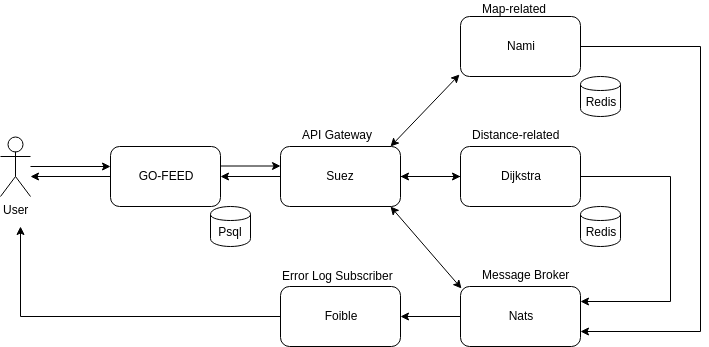

# GO-FEED 

GO-FEED service for COMPFEST X Software Engineering Academy with GO-JEK

## Getting Started

### Installation

Using `docker`:

1. Install `docker` and `docker-compose`.
2. `cp env.sample .env` and set values accordingly.
3. `docker-compose up`.
4. `docker-compose exec web rails db:setup`.

### Usage

1. Visit `localhost`.

## Built With

* [Ruby on Rails](https://rubyonrails.org/)
* [PostgreSQL](https://www.postgresql.org/)
* [Materialize](https://materializecss.com/)
* [Docker](https://www.docker.com/)

##### Microservices:

* [Go](https://golang.org/)
* [Redis](https://redis.io/)
* [NATS](https://www.nats.io/)

## Architecture

## Authors

* **Devin Alvaro** - [devinalvaro](https://github.com/devinalvaro)
* **Laurentius Dominick Logan** - [Log-baseE](https://github.com/Log-baseE)
* **Maxalmina Satria Kahfi** - [Maxalmina](https://github.com/Maxalmina)
* **Jonathan Christopher Jakub** - [Jonathanjojo19](https://github.com/Jonathanjojo19)

## Acknowledgments

* COMPFEST-X 2018
* GO-JEK Academy
